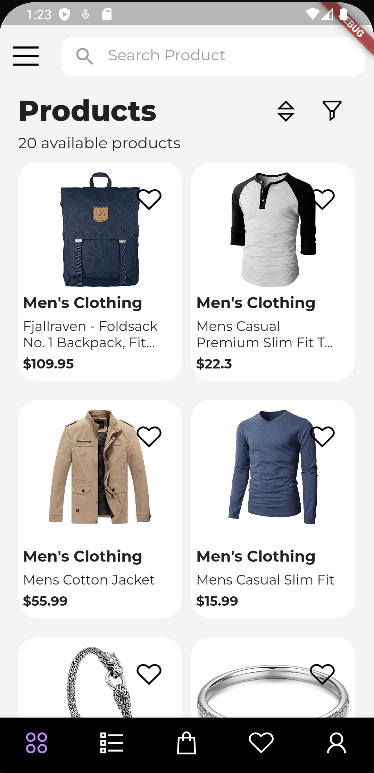

<!-- PROJECT LOGO -->
<br />
<p align="center">
  <a href="https://github.com/yugal-panchal/shopping-app">
    
  </a>

  <h3 align="center">Shopping App</h3>

  <p align="center">
    A hybrid shopping app written in Flutter/Dart.
    <br />
    <br />
    ·
    <a href="https://github.com/yugal-panchal/shopping-app/issues">Report Bug</a>
    ·
    <a href="https://github.com/yugal-panchal/shopping-app/issues">Request Feature</a>
  </p>
</p>

<!-- TABLE OF CONTENTS -->
<details open="open">
  <summary>Table of Contents</summary>
  <ol>
    <li>
      <a href="#about-the-project">About The Project</a>
      <ul>
        <li><a href="#built-with">Built With</a></li>
        <li><a href="#Feature">Features</a></li>
      </ul>
    </li>
    <li>
      <a href="#getting-started">Getting Started</a>
    </li>
    <li><a href="#roadmap">Roadmap</a></li>
    <li><a href="#contact">Contact</a></li>
  </ol>
</details>

<!-- ABOUT THE PROJECT -->

## About The Project


<br>

It is a hybrid shopping app for both Android and IOS written in Flutter/Dart.

### Built With

- [Flutter](https://flutter.dev/)
- [Dart](https://dart.dev/)
- [FireBase](https://firebase.google.com/)
- [Fakestore APIs](https://fakestoreapi.com/)

### Features

- Product Listing.
- Filter product based on category.
- Like Product.
- Specific screen for liked products.
- Search products

<!-- GETTING STARTED -->

## Getting Started

To start with the project, you can simply download the [apk]() here or you can follow along the instructions to
download and run the whole project in emulator.

1. Clone the repo
   ```sh
   git clone https://github.com/yugal-panchal/shopping-app.git
   ```
2. Inside the project folder run
   ```sh
   flutter pub get
   ```
3. Open iOS Emulator, For iOS the command is:
   ```sh
   open -a simulator
   ```
4. Open Android Emulator, For Android the command is:
   ```sh
   emulator -avd avd_name [ {-option [value]} … ]
   ```
5. Then run the project using
   ```sh
   flutter run
   ```

<!-- ROADMAP -->

## Roadmap

- Adding add to cart option.
- Adding login/signup feature.
- Buy now option with payment feature.

See the [open issues](https://github.com/yugal-panchal/shopping-app/issues) for a list of proposed features (and known issues).

<!-- CONTACT -->

## Contributing

Yugal Panchal - [@yugal1005](https://www.instagram.com/yugal1005/) - yugalpanchal01@gmail.com

Project Link: [https://github.com/WarMac4964/BaatCheet](https://github.com/yugal-panchal/shopping-app)
